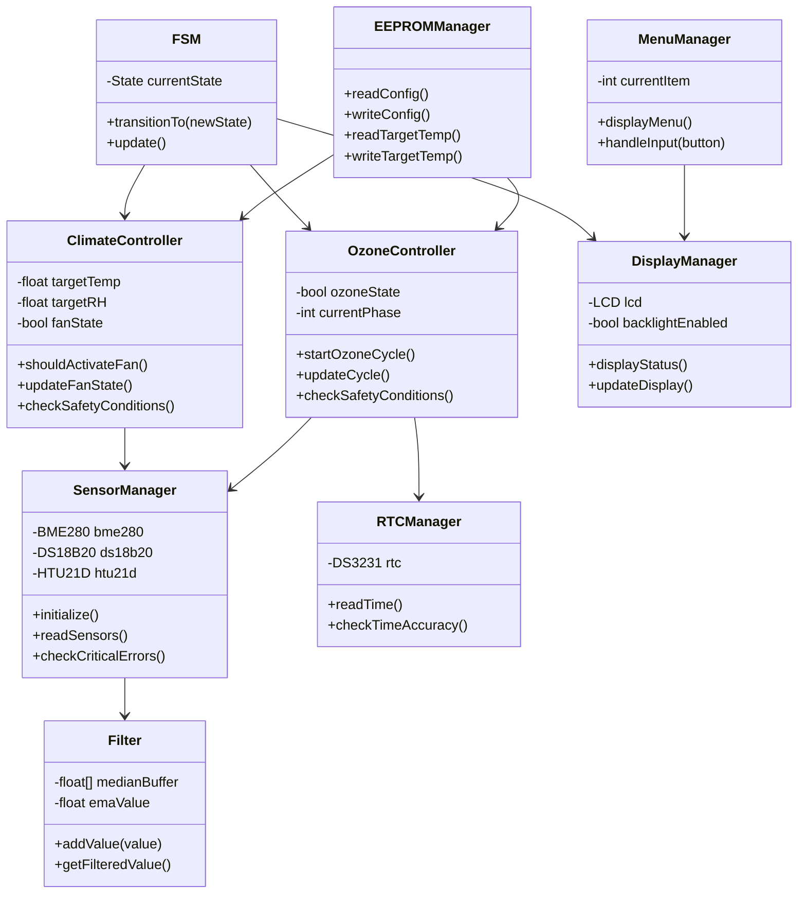

# Контроллер вентиляции и озонирования подвала

## Описание проекта

Система автоматического контроля климата в подвале на базе Arduino Nano. Проект реализует функции климат-контроля и озонирования для поддержания оптимальных условий хранения в подвале.

## Архитектурные особенности

Проект построен по модульной архитектуре с использованием объектно-ориентированного подхода. Основные компоненты:

- **SensorManager** - управление датчиками (BME280, DS18B20, HTU21D)
- **Filter** - фильтрация данных датчиков (медианный фильтр и EMA)
- **ClimateController** - реализация алгоритма климат-контроля
- **OzoneController** - управление циклом озонирования
- **FSM** - машина состояний для управления системой
- **EEPROMManager** - работа с энергонезависимой памятью
- **MenuManager** - управление меню
- **DisplayManager** - управление дисплеем LCD 1602
- **RTCManager** - работа с RTC DS3231
- **Utils** - вспомогательные функции

## Технические характеристики

- Платформа: Arduino Nano
- Периферия:
  - BME280 (внутренние показания)
  - DS18B20 (контрольный датчик подвала)
  - HTU21D (уличные показания)
  - DS3231 RTC с аккумулятором
  - LCD 1602 (I2C)
  - 3 кнопки: UP, DOWN, MENU
  - SSR реле: FAN, OZONE

## Алгоритмы

### Климат-контроль
- Цель: T = 4°C, RH = 85%
- Гистерезис: T ±0.5°C, RH ±3%
- Safety margin конденсации: 2°C
- Алгоритм включения вентилятора (вариант С):
```
if ( (T_in > TargetTemp+hyst OR RH_in > TargetRH+hyst)
 AND (AH_out + margin < AH_in)
 AND (dewpoint_in + 2°C < T_in) ) then FAN ON
else FAN OFF
```

### Озонирование
- Запуск по расписанию (раз в неделю в 02:00)
- Цикл: OZONE ON 15 мин → Пауза 2 часа → Форсированное проветривание 15 мин
- Запрещено при T_out < 0°C и при включенной подсветке дисплея

## Архитектурные диаграммы



## Состояния FSM

- IDLE
- AUTO CLIMATE CONTROL
- OZONE_START
- OZONE_ACTIVE (15 мин)
- OZONE_HOLD (2ч)
- OZONE_VENT (15 мин)
- OZONE_ABORT
- MANUAL FAN
- MANUAL OZONE
- ERROR

## Конфигурация

Все настройки хранятся в EEPROM:
- Целевые значения температуры и влажности
- Калибровочные смещения датчиков
- Расписание озонирования
- Журнал событий
- Счетчики работы устройств

## Безопасность

Система реализует два уровня ошибок:
- Критические (требуют ручного сброса)
- Мягкие (автоматическое восстановление)

## Отладка

Отладочный вывод через Serial при определении `DEBUG` в config.h